<h1 align="center">Wassup 👋</h1>

  

---

<h3 align="center">🚀 Stats 📊</h3>

  
  

---

<h3 align="center">⌨️ Languages & Tools 🛠️</h3>

  
  
  
  
  
  
  
  
  

---

<h3 align="center">🖥️ Programms 💾</h3>

  
  
  
  

---

  
  
        
      

